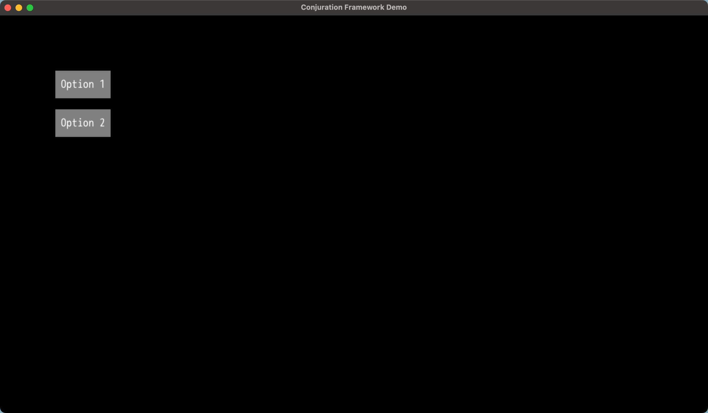

# UI & HUD Management

## Example

```ruby
class MyScene < Conjuration::Scene
  def setup
    add_camera(:main)

    # Set root container to grid.rect. This is the entire 1280x720 screen.
    state.ui = Conjuration::UI.build(grid.rect, padding: 100, gap: 20) do
      node({ w: 100, h: 50, path: :pixel, r: 128, g: 128, b: 128 }, justify: :center, align: :center) do
        node({ text: "Option 1", r: 255, g: 255, b: 255 })
      end

      node({ w: 100, h: 50, path: :pixel, r: 128, g: 128, b: 128 }, justify: :center, align: :center) do
        node({ text: "Option 2", r: 255, g: 255, b: 255 })
      end
    end
  end

  def render
    outputs.primitives << state.ui.primitives
  end
end
```



## API Reference

The entirety of the UI library is managed by a single class, `Conjuration::UI::Node`. You can compose a tree of nodes together to create complex UI layouts.

### `Conjuration::UI.build(root, **options, &block) -> Conjuration::UI::Node`

This is the entry point for building a UI. It takes in a root container as a rect-like hash.

### `node(object, **options, &block)`

Within the block of a `Conjuration::UI::Node`, you can create child nodes using the `node` method.

The `object` will be returned to the following methods:

- `#nodes`
- `#interactive_nodes`
- `#primitives`

It can be set by sending a hash to the `node` method:

```ruby
node({ w: 100, h: 50, path: :pixel, r: 128, g: 128, b: 128 })
```

### `#find(id) -> Conjuration::UI::Node`

Finds a node within the UI tree by its ID. It can be infinite levels deep.
